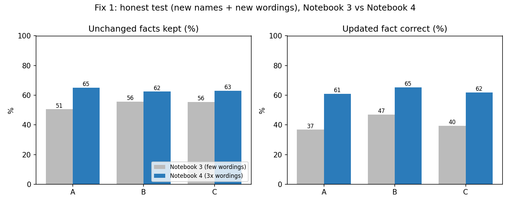
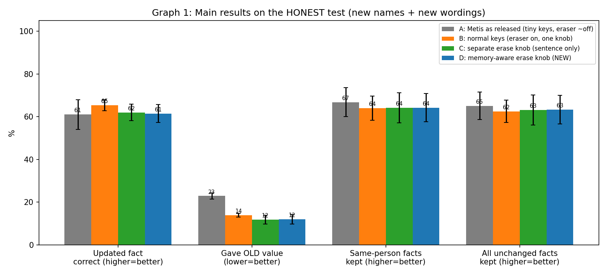
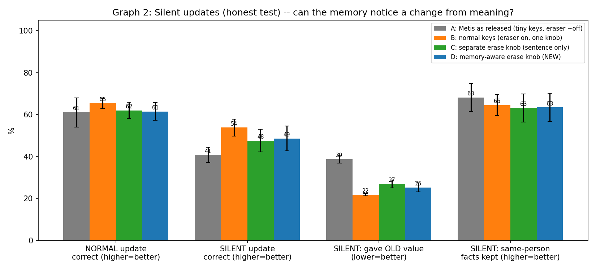
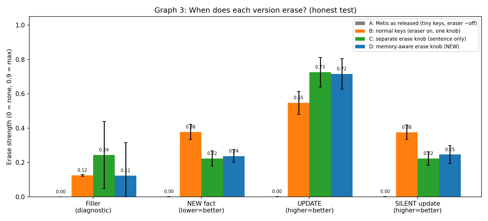
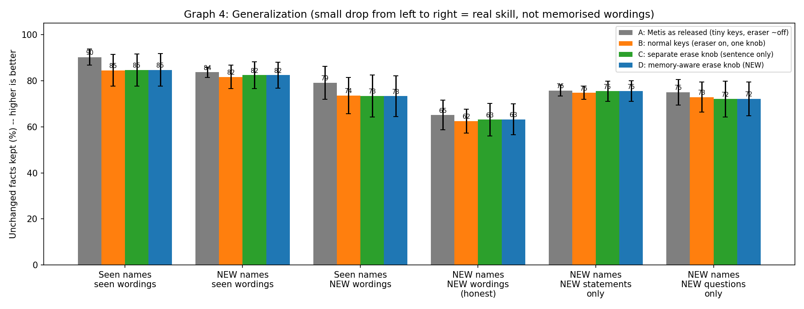
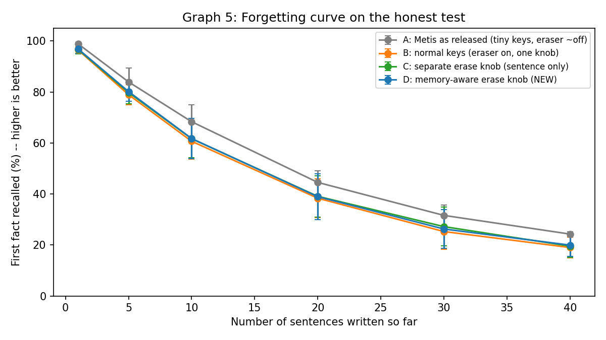

# Content-Aware Selective Memory Retention in Metis-Style Native Memory — Progress Report

**Student:** Md. Adnan Abdullah Sadi · CSE, North South University · Final-year capstone
**Base work:** Metis: Memory Foundation Model (arXiv 2607.26760)

---

## 1. The plan

Metis stores facts in a fast-weight memory matrix. Each new sentence can **erase** what is stored under its key and **write** a new value. One learned gate (β) controls both.

**Hypothesis:** a memory that decides *when* to erase, based on the content of the sentence, should update changed facts ("Rafi moved to Oslo") without damaging facts that did not change.

**Planned comparison:** four memory versions, identical except for the erase rule.

| Version | Erase rule |
|---|---|
| **A** | Metis as released. Keys are scaled by 1/√d, which leaves the eraser almost off. |
| **B** | Normal-size keys, so the eraser works. Still one knob for write and erase (the "simple fix"). |
| **C** | Separate erase gate that reads the current sentence only (my first idea). |
| **D** | Separate erase gate that also reads what is already stored in memory (my second idea). |

## 2. What I did

| Step | Work | Outcome |
|---|---|---|
| Notebook 2 | First A/B/C comparison | About 90% on training names but only 20–35% on new names: the memory had memorised names. Results not trustworthy. |
| Notebook 3 | 400 names, held-out names **and** wordings ("honest test"), silent-update test, pre-registered pass/fail rules | New names solved; new **wordings** still weak (about 54%). C learned to erase on update *words* only. |
| Notebook 4 | 3× more wordings, version D, 30% silent updates in training (same for all), 4 versions × 3 seeds, automatic final decision | Results below. |

**Setup:** frozen Qwen2.5-1.5B sentence encoder, 512×512 memory, 3,000 training steps, 2,000 test stories per condition. All versions are trained on the same stories and tested on the same stories.

**Test:** "honest" means new names **and** new wordings never seen in training. A "silent update" is a change written as a plain statement, e.g. "Rafi resides in Oslo" with no "moved" or "now".

## 3. Results (Notebook 4, honest test, mean ± std over 3 seeds)

### 3.1 Fix 1 worked: the test bed now generalises much better

| | Notebook 3 | Notebook 4 |
|---|---|---|
| Unchanged facts kept (avg of versions) | ~54% | **63.5%** |
| Gap between seen and new wordings | ~35 points | **22.5 points** |

### 3.2 Main results

| Metric (honest test) | A (Metis) | B (simple fix) | C (sentence gate) | D (memory gate) |
|---|---|---|---|---|
| Updated fact correct (%) ↑ | 61.0 ± 7.0 | **65.4 ± 2.5** | 61.9 ± 3.8 | 61.5 ± 4.3 |
| Gave the OLD value (%) ↓ | 22.9 ± 1.4 | 13.8 ± 0.9 | **11.8 ± 2.1** | 12.0 ± 2.3 |
| Unchanged facts kept (%) ↑ | **65.1 ± 6.4** | 62.5 ± 5.2 | 63.1 ± 7.1 | 63.2 ± 6.7 |
| **Silent** update correct (%) ↑ | 40.7 ± 3.6 | **53.8 ± 4.0** | 47.6 ± 5.4 | 48.6 ± 5.9 |
| **Silent** update gave OLD value (%) ↓ | 38.8 ± 1.9 | **21.8 ± 0.6** | 26.9 ± 1.9 | 25.2 ± 2.1 |
| First fact after 40 writes (%) ↑ | **24.3 ± 0.9** | 19.0 ± 4.1 | 19.5 ± 4.4 | 19.9 ± 4.4 |

### 3.3 Why D did not help: its gate cannot tell a silent update from a new fact

| Erase strength (0 to 0.9) | B | C | D |
|---|---|---|---|
| on new facts (should be low) | 0.378 | 0.223 | 0.237 |
| on normal updates (should be high) | 0.547 | 0.726 | 0.716 |
| on silent updates (should be high) | 0.376 | 0.223 | 0.246 |

C and D both erase strongly when the sentence *says* something changed. On silent updates, however, they erase exactly as much as on new facts. The memory-aware signals in D added almost nothing.

### 3.4 Pre-registered checks (rules fixed before running)

| Check | Result | Numbers |
|---|---|---|
| G: test bed generalises | ✅ PASS (usable) | 63.5% unchanged kept |
| E: B beats A on updates by ≥ 5 points | ❌ FAIL (borderline) | +4.4 points, 2/3 seeds |
| M: D's gate reacts to meaning | ❌ FAIL | silent 0.246 vs new fact 0.237 |
| S: D beats C on silent updates by ≥ 5 points | ❌ FAIL | +1.0 point |
| X: D beats simple fix B | ❌ FAIL | −5.2 (silent), −3.9 (normal), 0/3 seeds |
| SAFE: D does not damage other facts | ✅ PASS | within ±1.2 points of B |

**Automatic decision:** *Move on, or present as a negative result.*

## 4. Conclusions

1. **The proposed idea did not work.** Neither the sentence-only gate (C) nor the memory-aware gate (D) beat the simple fix of just turning the eraser on (B). D ≈ C on every metric.
2. **Consistent secondary finding.** In released Metis the eraser is effectively off. Turning it on reduces stale answers by about 9 points on normal updates and about 17 points on silent updates, and improves silent updates by about 13 points (3/3 seeds each). The main pre-registered update check narrowly missed, so I report this as a secondary result.
3. **Trade-off.** Metis's near-disabled eraser keeps long-range memory slightly better: 24% vs about 19% of the first fact after 40 writes.
4. **Method contribution.** An honest evaluation protocol (held-out names *and* wordings, silent updates, pre-registered rules, paired seeds). It exposed that the early positive results came from memorisation.

**Limitations:** small synthetic task, frozen Qwen2.5 encoder instead of the full Metis model, 3 seeds, and a remaining gap of about 22 points on new wordings.

## 5. Proposed next step (to discuss)

Stop experimenting on Metis gating. Either:
- present this work as a careful negative result, or
- choose a new direction together.

---

### Appendix: additional figures

